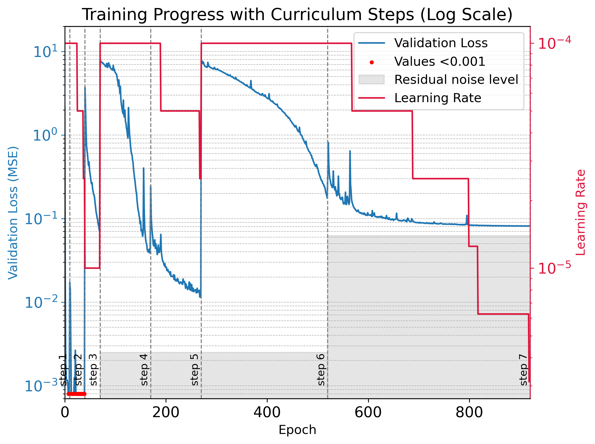
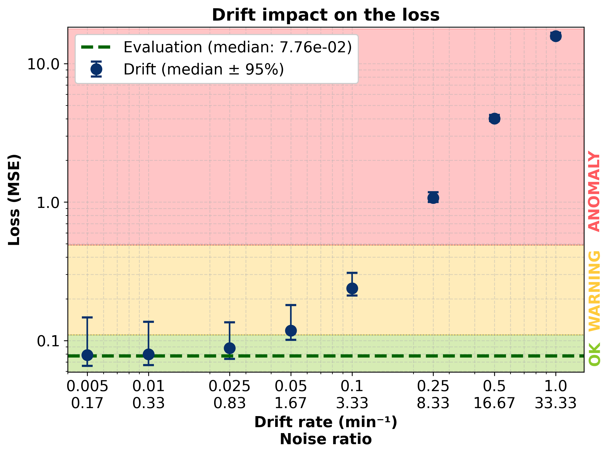

|                                                                                                                                                                                                                                                                                                                                                                                                                                                      |
|:-----------------------------------------------------------------------------------------------------------------------------------------------------------------------------------------------------------------------------------------------------------------------------------------------------------------------------------------------------------------------------------------------------------------------------------------------------|
| This study stems from a personal curiosity about the implementation of autoencoders for anomaly detection in signal processing. This type of approach is already widely documented on *Papers With Code*; here are a few relevant references. For me, it’s also an opportunity to get hands-on experience in a new area of deep learning: autoencoders applied to time series, a topic I already understand well from a signal analysis perspective. |

The goal of this study is to test the limits of autoencoder-based anomaly detection in time-series signals. Given the breadth of the topic, I limited the study to sinusoidal signals affected by Gaussian noise and drift noise, the latter being typical of wear in electronic components.

This post consists of three sections:
1. A summary of how autoencoders work, with the parameters used in this study.
2. The "step-by-step" training strategy to address the periodic nature of the signals.
3. A model evaluation on noisy signals with a controlled drift ratio.

---

## AI Model

### Basics of Autoencoders

An autoencoder is a type of neural network designed to reconstruct its input after compressing it into a lower-dimensional latent space. It has two parts:

- The encoder: reduces the input dimensionality to extract its essential features.
- The decoder: reconstructs the input from the compressed representation.

In unsupervised learning, an autoencoder can learn dominant patterns in the data. Any significant reconstruction error then indicates an anomaly (i.e., data that deviates from the learned patterns).

The standard loss function is the Mean Squared Error:

$$
 \text{MSE} = \frac{1}{n} \sum_{i=1}^n (x_i - \hat{x}_i)^2
$$

where $$x_i$$ is the original data and $$\hat{x}_i$$ is its reconstruction.

---

### My Model

The model used in this study is a 1D convolutional autoencoder designed for fixed-length time signals (500 samples). It consists of two main blocks: an encoder and a decoder, built from convolutional layers suited to time-structured data.

#### Encoder

The encoder transforms the input signal into a low-dimensional latent representation. It includes:

Three successive 1D convolutional layers with:

- Increasing numbers of channels (16, 32, then 64),
- A kernel size of 5,
- A stride of 2 to progressively reduce temporal resolution,
- A ReLU activation after each convolution.

The output is then flattened into a linear vector and passed through a fully connected layer to produce a latent embedding of predefined size (`encoded_size`).

#### Decoder

The decoder reconstructs the original signal from the latent representation. It mirrors the encoder:

- A first fully connected layer reshapes the latent vector into a tensor suitable for the transposed convolutional layers.
- Three transposed convolution layers:
  - They progressively increase the temporal resolution,
  - Reduce the number of channels from 64 → 32 → 16 → 1 (the original shape),
  - Each step is followed by a ReLU activation, except the last.

This architecture allows the model to learn to extract key features from the input signal and reconstruct them as faithfully as possible. Latent compression forces the autoencoder to filter noise and retain only essential information.

This model encodes 500-sample input signals into a latent space sized at 30% of the input, and reconstructs them via transposed convolutions. The architecture is intentionally compact to facilitate progressive learning of simple patterns.

---

## Model Training

### Training Data

Training is conducted on batches of 12,000 signals, each 500 samples long, fed in mini-batches of 32 to the GPU. Each signal is a noisy sinusoid, randomly generated according to the parameters defined for each training phase.

---

### Step-by-Step Training Strategy

Training progresses through increasingly complex signal generations. The summary table is as follows:

| Step | Epochs | Amplitude                 | Phase                   | Frequency (Hz)                | Noise                        |
|-----:|-------:|:--------------------------|:------------------------|:------------------------------|:-----------------------------|
| 1    | 10     | 4                         | 0                       | 0.05                          | None                         |
| 2    | 30     | $$\mathcal{U}(3.5, 4.5)$$ | 0                       | 0.05                          | None                         |
| 3    | 30     | $$\mathcal{U}(3.5, 4.5)$$ | $$\mathcal{U}(0, 0.5)$$ | 0.05                          | None                         |
| 4    | 100    | $$\mathcal{U}(3.5, 4.5)$$ | $$\mathcal{U}(0, 0.5)$$ | $$\mathcal{U}(0.025, 0.075)$$ | None                         |
| 5    | 100    | $$\mathcal{U}(3.5, 4.5)$$ | $$\mathcal{U}(0, 0.5)$$ | $$\mathcal{U}(0.025, 0.075)$$ | $$\mathcal{N}(0, 0.05)$$     |
| 6    | 250    | $$\mathcal{U}(2, 6)$$     | $$\mathcal{U}(0, 2π)$$  | $$\mathcal{U}(0.025, 0.225)$$ | $$\mathcal{N}(0, 0.05)$$     |
| 7    | 400    | $$\mathcal{U}(2, 6)$$     | $$\mathcal{U}(0, 2π)$$  | $$\mathcal{U}(0.025, 0.225)$$ | $$\mathcal{N}(0, 0.25)$$     |

A `ReduceLROnPlateau` scheduler dynamically adjusts the learning rate from an initial value of $$10^{-4}$$, if validation loss plateaus.

---

### Residual Noise

Due to the random nature of the added noise, perfect signal reconstruction is impossible. The final loss therefore stabilizes to a non-zero residual noise.

Assuming:

$$\text{signal}_{\text{target}} = \text{informative}_{signal} + \text{random}_{noise}$$

and perfect reconstruction of the informative part, the MSE becomes:

$$\text{MSE} = \frac{1}{n} \sum_{i=1}^n [(\text{output} - \text{target})^2] = \frac{1}{n} \sum_{i=1}^n [\text{random}_{noise}^2]$$

In this study:
- Steps 4–6: residual noise ≈ 0.0025
- Step 7: residual noise ≈ 0.0625

*Blue : Validation loss evolution across the different training steps described on the previous table.
Red : Learning rate evolution across the training. The grey zone represents the theoretical limits the model cannot overtake.*

---

## Evaluation and Testing on Noisy Signals

### Model Evaluation

The model is evaluated on 10,000 new signals generated with the parameters of Step 7.  
Observed median loss:

$$\text{MSE}_{\text{test}} = 0.078^{+0.053}_{-0.012}$$

This is compatible with residual noise, indicating good generalization capacity.

---

### Drift Noise

A drift component was added to the signals:

> Drift is a slow and continuous signal shift over time. It can be modeled with an affine function:

$$\text{drift}(t) = \alpha \cdot t$$

where $$\alpha$$ is the drift coefficient.

*Examples of drifted signals and their reconstruction for various values of $$ \alpha $$.*

---

### Anomaly Detection

The model fails to reconstruct signals containing unseen drift, as expected. For each drift ratio, the loss is compared to evaluation percentiles:

- **OK**: MSE < 95ᵗʰ percentile
- **WARNING**: 95ᵗʰ percentile < MSE < max
- **ANOMALY**: MSE > max (evaluation)

To quantify detection threshold, we define the Noise ratio :

$$\text{Noise ratio} = \frac{\text{total}_{drift}}{\text{residual}_{error}}$$

The model detects anomalies as soon as the noise ratio reaches 1.6, which shows high sensitivity. This could be improved by increasing signal length.

*Performance for drift signal reconstitution for various values of $$\alpha$$.*

---

## Conclusion

Autoencoders prove effective for detecting anomalies in sinusoidal signals contaminated by Gaussian noise and drift. The method is particularly sensitive to gradual deviations, as long as their amplitude exceeds the residual noise.

Next steps:
- Use longer signals to detect subtler drift.
- Explore other waveform types: triangular signals, Heaviside functions, etc.
- Test the hypothesis that training difficulties stem from the zero-mean nature of sinusoids — e.g., by adding an offset.

This project is a proof-of-concept on simulated data. It would be relevant to test this approach on real-world data to assess its industrial potential.

---