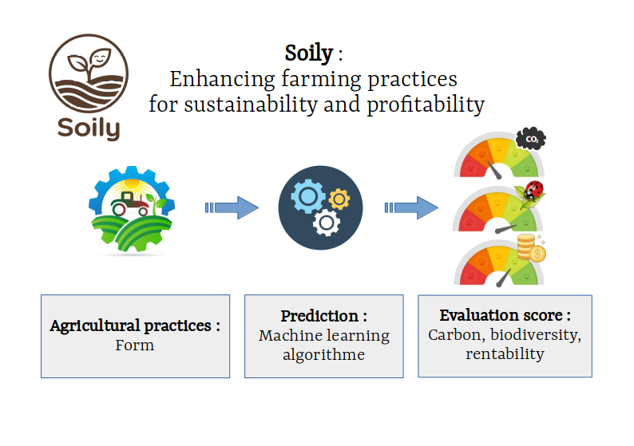

This project was developed during the **Hackathon Gaia**, organized by **La Ferme Digitale** during the annual **Salon International de l’Agriculture** in France.

The challenge was proposed by **Mycophyto**, a company based in southern France that develops solutions based on fungal ecosystems to improve agricultural sustainability. Their approach enhances nutrient exchanges between plants while preserving biodiversity, soil health, and carbon balance.

The objective of the hackathon was to build, within **36 hours**, a prototype application capable of **evaluating vineyard agricultural practices** according to three complementary dimensions:

- **Carbon** – the capacity of soils to store or release carbon  
- **Biodiversity** – the support of microbial and ecological diversity in soils  
- **Economics** – the economic viability of farming practices  

The resulting tool, **Soily**, aims to help farmers explore the environmental and economic impacts of their practices and support the transition toward more sustainable viticulture.

---

## Participants

- **Audrey Lamy Martinot** – MYCOPHYTO / Data Acteur, Chief Data Officer  
- **Claire Benezech** – Institut Agro Montpellier, Postdoctoral Researcher (PHIM)  
- **Antoine Andrieu** – MYCOPHYTO, Data Engineer / Developer  
- **Valentine Fontaine** – Institut Agro Montpellier, Intern  
- **Carole Perigois** – Data Scientist, Machine Learning  
- **Enzo Peraldi** – Student, Statistics and Programming  

🔗 **GitHub repository:** <https://github.com/mycophyto/hackathon-gaia>  
🌐 **Prototype platform:** <https://soily.mycophyto.app/>

---

# Context and Motivation

Modern agriculture faces increasing pressure to reduce its environmental footprint while maintaining economic viability. In viticulture, this challenge is particularly significant because farms often operate with **limited margins and little flexibility in production volumes**.

A large number of scientific methods and datasets exist to evaluate agricultural practices, especially regarding **carbon balance, biodiversity, and soil resilience**. However, these indicators are often difficult to compare, interpret, or translate into actionable decisions for farmers.

Two major obstacles limit their adoption:

- the **lack of clear and widely recognized scientific indicators**
- the **absence of easily identifiable economic benefits**

The challenge proposed by Mycophyto focuses specifically on **vineyard soils**, aiming to evaluate how farming practices influence two essential soil functions:

- **microbial biodiversity support**
- **carbon storage and sequestration**

Vineyards were chosen as a case study because they are **perennial open-field crops**, strongly linked to soil health and long-term ecosystem dynamics.

The goal of the hackathon was therefore to build, within a short time frame, a **functional proof of concept (PoC)** capable of:

- comparing the effects of agricultural practices on **carbon sequestration and biodiversity**
- highlighting **innovative agricultural practices**
- supporting **agroecological transition among farmers**
- providing **transparent and scientifically traceable indicators**

Ultimately, such indicators could evolve toward **shared standards for evaluating agricultural sustainability**.

---

# Overview

The prototype relies on agricultural data from the **DEPHY farm network**, a French program designed to promote productive farming systems while reducing pesticide use.

- DEPHY data platform:  
  https://agrosyst.fr/datagrosyst/

- Presentation of the DEPHY network:  
  https://agriculture.gouv.fr/le-reseau-dephy-partout-en-france-des-systemes-de-production-performants-et-economes-en-pesticides

The platform follows a simple workflow:

1. **Collect agricultural practice information** from farmers through a questionnaire.
2. **Translate these practices into quantitative variables.**
3. **Estimate three indicators**:
   - Carbon impact
   - Biodiversity support
   - Economic performance

These indicators provide a simplified but interpretable way to evaluate the **sustainability of vineyard management strategies**.

  

---

# Scientific Approach

The project addresses three main technical challenges:

1. **Extracting and cleaning relevant vineyard data** from the DEPHY database.
2. **Building interpretable indicators** for carbon, biodiversity, and economic performance.
3. **Developing a machine learning model** capable of predicting these indicators from farmer inputs.

The final application connects a **simple questionnaire interface** to the underlying model, enabling users to obtain an estimation of their farm's environmental and economic performance.

---

## 1. Initial Score Construction

As a first approximation, the indicators are computed using a **simple additive approach**.

Each agricultural practice is associated with an estimated effect on:

- carbon balance
- biodiversity
- economic performance

These effects are derived from patterns observed in the **DEPHY dataset**. The total score for a farm is obtained by **aggregating the contributions of each practice**. This approach is intentionally simple and transparent, allowing quick prototyping and easy interpretation.

A summary table (shown here) presents the contribution of each practice to the three indicators.

---

## 2. Feature Engineering: From Agricultural Data to Model Inputs

To ensure consistency between **observational farm datasets** and **farmer questionnaire responses**, both sources are transformed into a standardized set of numerical variables used as input features for the machine learning model.

The table below summarizes the correspondence between the **physical meaning of each variable**, the **DEPHY dataset fields**, and the **encoding derived from farmer responses**.

| Feature | Description | Encoding from DEPHY Dataset (`input_ML_from_data`) | Encoding from Farmer Questionnaire (`input_ML_from_answers`) |
|--------|-------------|----------------------------------|--------------------------------|
| **latitude** | Geographic latitude of the farm location | `latitude` | Derived from postal code using `CP_to_lat_long()` |
| **longitude** | Geographic longitude of the farm location | `longitude` | Derived from postal code using `CP_to_lat_long()` |
| **NPK** | Composite fertilization intensity index representing nitrogen, phosphorus, and potassium inputs | `(p2o5 / 81) + (k2o / 150) + ((11 + n) / 161) + (ferti_n_tot / 24000)` | Categorical fertilization level mapped to numeric values: `Low → 0.2`, `Moderate → 0.6`, `High → 0.95` |
| **mode_production** | Agricultural production system (e.g. organic vs conventional) | Placeholder (not available in current dataset) | Placeholder (not yet implemented in questionnaire) |
| **Phyto** | Intensity of phytosanitary treatments | Placeholder (not available) | Treatment frequency encoded as: `<5 → 2`, `5–10 → 7.5`, `>10 → 13` |
| **densite_plantation** | Vineyard planting density (plants per hectare) | `densite_plantation` | Category mapped to representative values: `Low → 1500`, `Medium → 4000`, `Dense → 7000` |
| **surface** | Vineyard cultivated area (hectares) | `surface` | Reported vineyard area |
| **rendement_moyen** | Average vineyard yield | `rendement_moyen` | Farmer-reported typical yield (`rendement_moyen_habituel`) |
| **biocontrole** | Use of biological pest control methods | `oui → 1`, `non → 0` | Boolean encoding: `True → 1`, `False → 0` |
| **enherbement** | Presence of soil cover or grass cover between vine rows | Not available in current DEPHY subset | Direct questionnaire input |
| **travail_du_sol_meca** | Frequency of mechanical soil management operations | `intervention_TRAVAIL_DU_SOL` | Number of mechanical soil operations (`travail_sol_meca`) |
| **travail_du_sol_mano** | Frequency of manual soil management operations | Not available | Estimated as `nb_passages − travail_sol_meca` |
| **intervention_plante** | Type of plant-level intervention | Not available | Encoded as: `Mechanical → 0`, `Mixed → 0.5`, `Manual → 1` |

This feature engineering step ensures that heterogeneous information sources—structured observational datasets and qualitative farmer responses—are transformed into a consistent numerical representation. These standardized variables constitute the input space used to train the machine learning model predicting the environmental and economic indicators.
---

## 3. Machine Learning Model

The next step is to train a machine learning model capable of predicting the three indicators from the standardized input variables.

Tree-based ensemble methods such as:

- **Random Forest**
- **XGBoost**

are well suited for this task because they:

- handle heterogeneous data well
- capture non-linear relationships
- provide interpretable feature importance

The model will learn statistical relationships between agricultural practices and the computed sustainability indicators, allowing the application to **interpolate realistic scores for new farms**.

---

# Limitations and Future Improvements

This hackathon project produced a **functional proof of concept**, but several improvements are required.

### Scientific validation

- Collaboration with **agronomy and soil science researchers** is needed to refine the indicator definitions.
- Uncertainty levels and methodological assumptions should be clearly quantified.

### Model improvements

- Improve the **machine learning pipeline**
- Expand the **feature engineering and data coverage**
- Increase the robustness of predictions

### Decision-support capability

A future step would consist of **reversing the model logic** to move from evaluation to recommendation.

Instead of only scoring practices, the tool could suggest **alternative farming strategies** that simultaneously improve:

- economic performance
- biodiversity
- soil carbon storage

Such a system could become a **decision-support tool for agroecological transition in viticulture**.

